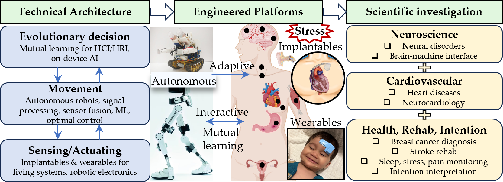

---------
{: width="600px" style="float:center"} 

**The research of Du Group will focus on three aspects.**
* Design, fabrication, and signal processing of **multimodal, multi-point wearable and implantable bioelectronic sensor systems**, with applications in intelligent health monitoring and disease diagnosis and prevention in healthcare.
* Safe and efficient **human-in-the-loop** human-robot/computer interaction enabled by bioelectronics and brain-computer interfaces.
* Application of integrated control and machine learning (including reinforcement learning) to **robotics automation in challenging medical environments**, such as hospital ICUs.

[Learn more](./research)

---------

**Group News**

