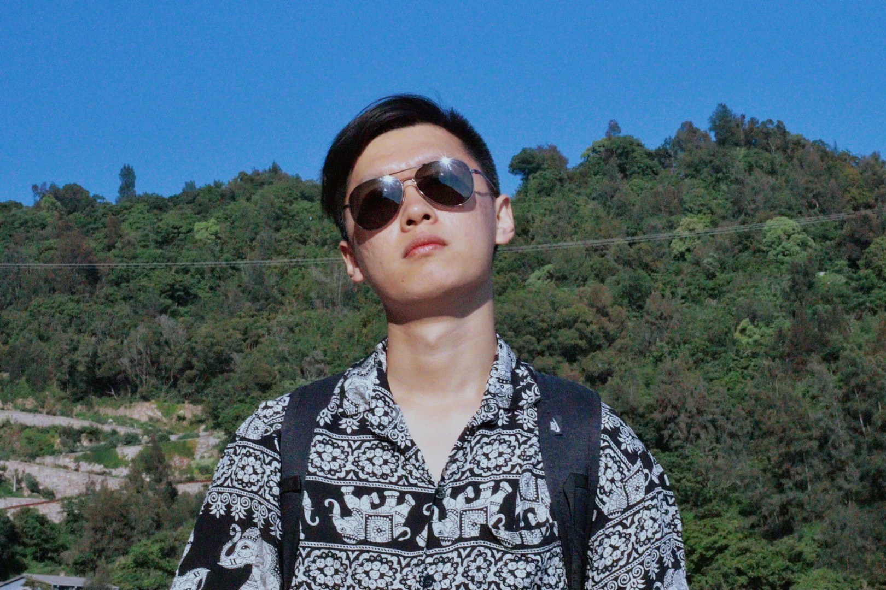
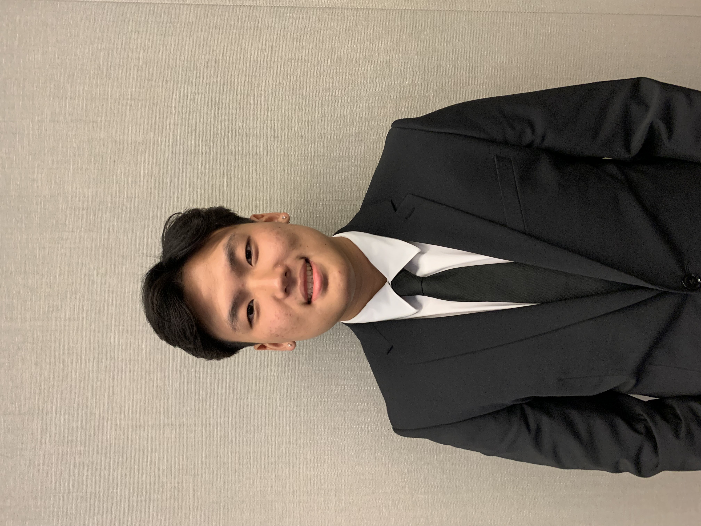
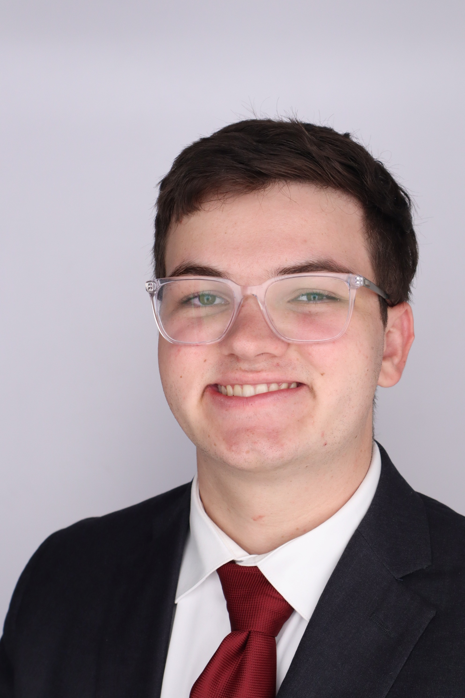

# Members

## Principal Investigator: Dr. Yayun Du 

<a href="Yayun_Du_CV_updated.pdf" target="_blank" style="font-size: 1rem; font-weight: bold; color: #ffffff; background-color: #159957; padding: 10px 20px; border-radius: 3px; text-decoration: none; display: inline-block;">
    View My CV
</a>

{: width="250px" style="float:left; padding-right:10px"} 
Dr. Yayun Du is an Assistant Professor of Electrical and Computer Engineering at Vanderbilt University, with an affiliation to the Vanderbilt Institute for Surgery and Engineering (VISE). Dr. Yayun Du got her Ph.D. in Robotics and System Control (Minor: Solid Mechanics) from [University of California, Los Angeles](https://structures.computer/). From 2022 to 2024, Dr. Du was a postdoctoral scholar at the [**Rogers Group**](https://rogersgroup.northwestern.edu/) at Northwestern University, where she **led 5 projects**, focused on developing multimodal and multiparametric wearable and implantable sensors with integrated edge AI for monitoring cardiopulmonary (e.g., aortic stenosis, atrial fibrillation, and heart failure), neurological (e.g., sleep studies, delirium, coma, and epilepsy), and vocal system health, as well as for disease diagnosis and drug delivery. Her work has led to the deployment of four types of sensors across seven hospitals, benefiting **hundreds of users globally**, from **neonates to the elderly**, in countries including China, Canada, Mexico, the U.S., and the U.K.

Currently, Dr. Du involves in **commericializing** the sensors she developed and serves as an Associate Editor for ICRA 2025. She has submitted several first-authored manuscripts to prestigious journals that are forthcoming. Dr. Du has also published in top robotics journals and conferences, including the IEEE-Robotics and Automation Letters (RAL), IEEE International Conference on Robotics and Automation (ICRA), and IEEE/RSJ International Conference on Intelligent Robots and Systems (IROS). Her work was a finalist for the Best Paper Award in Agri-Robotics and the Best Paper Award in Robot Mechanisms and Design at IROS 2021 (selected 4 out of 1261 for each category). 

### Selected Honors and Awards
* 2023 Humboldt Fellowship from Alexander von Humboldt Foundation (25% - 30%) 
* 2021 Finalists for **Best Paper Award on Agri-Robotics**, **Best Paper Award on Robot Mechanisms and Design** in IROS 2021 (4/1261 for each category)
* 2021 **MIT Civil and Environmental Engineering (CEE) Rising Stars**
* 2021 Supervisor of Honorable Mention Best Researcher in the National Science Foundation Summer-funded Undergraduate Researcher Program (SURP) 2021 at UCLA
* 2021 Chinese-American Engineers and Scientists Association of Southern California (CESASC) Scholarship
* 2018-2021 Graduate Division Fellowship from UCLA Graduate Division
* 2012-2016 **National Scholarship** from Ministry of Education of the People’s Republic of China with first GPA
ranking (1/144) for four years in Department of Automotive Engineering
* 2015 **Top Ten Students** of Harbin Institute of Technology, Weihai (10/12000)
* 2015 **Outstanding Leader Award** from Harbin Institute of Technology for academic excellence and fantastic student club activity organization 
* 2014 **Best-organized Volunteer Team Leader** from Harbin Institute of Technology for establishing the first volunteer team of college students to teach in Tibet and building long-term cooperation with the local government
* 2013 **First Prize** from Heilongjiang Provincial Education Department in Mathematics Competition for
College Students (Top 8%)
* 2013 **First Prize** from College Foreign Language Teaching Committee and College Foreign Language Teach-
ing Research Association in National English Competition for College Students (Top 0.5%)

## Graduate students

  

    
  

  

    
Tengyue Wu (M.S)

    <ul>
        <li><strong>Concentration:</strong> Electrical and Computer Engineering</li>
        <li><strong>Project/Team:</strong> Firmware and Application Design</li>
        <li><em>"My goal is to gain a comprehensive understanding of the whole engineering system and work on things that are meaningful to people—something that can actually contribute to scientific progress."</em></li>
    </ul>
  

  

    
  

  

    
Xinmei Huang (M.S)

    <ul>
        <li><strong>Concentration:</strong> Systems Engineering</li>
        <li><strong>Project/Team:</strong> Firmware and Medical Sensor Design</li>
        <li><em>“I am very interested in the integration of hardware and software. I believe that developing medical sensors has great social significance and is a field worth fully dedicating myself to.”</em></li>
    </ul>
  

  

    
  

  

    
Siva Sai Chaitanya Guardi

    <ul>
        <li><strong>Concentration:</strong> Electrical and Computer Engineering</li>
        <li><strong>Project/Team:</strong> Circuit Design</li>
        <li><em>“I joined Dr. Du’s lab to design circuits for best-in-class wearable and implantable medical devices.”</em></li>
    </ul>
  

## Undergraduate Students

  

    
  

  

    
Caiwan Sun

    <ul>
        <li><strong>Year:</strong> 2nd Year</li>
        <li><strong>Major:</strong> Electrical and Computer Engineering</li>
        <li><strong>Project/Team:</strong> Circuit Design</li>
        <li><em>"I joined the lab to turn hands-on experience into real-world impact."</em></li>
    </ul>
  

  

    
  

  

    
Vivian Zeru

    <ul>
        <li><strong>Year:</strong> 2nd Year</li>
        <li><strong>Major:</strong> Electrical and Computer Engineering (Concentrations in Microelectronics and Embedded Computing & Cyber-Physical Systems)</li>
        <li><strong>Project/Team:</strong> Circuit Design</li>
        <li><em>"I joined the lab because I am very interested in creating and designing technological devices to help others!"</em></li>
    </ul>
  

  

    
  

  

    
Chris Lee

    <ul>
        <li><strong>Year:</strong> 2nd Year</li>
        <li><strong>Major:</strong> Electrical and Computer Engineering</li>
        <li><strong>Project/Team:</strong> Circuit Design</li>
        <li><em>"I joined Du Group to see real world applications of work that I have provided contributions to. It is especially redeeming because I know that we are helping real people."</em></li>
    </ul>
  

  

    
  

  

    
Matthew Hu

    <ul>
        <li><strong>Year:</strong> 1st Year</li>
        <li><strong>Major:</strong> Computer Science and Economics</li>
        <li><strong>Project/Team:</strong> Application Design (Backend)</li>
        <li><em>"I joined Dr. Du's lab because her research stood out to me as one that could really help people. I was really fascinated by her work on wearable sensors as it has the potential for so much good for society, and I wanted to be part of that innovation."</em></li>
    </ul>
  

  

    
  

  

    
Isabelle Gunawan

    <ul>
        <li><strong>Year:</strong> 1st Year</li>
        <li><strong>Major:</strong> Computer Science</li>
        <li><strong>Project/Team:</strong> Robotics</li>
        <li><em>"I joined the lab because I wanted to learn more about how robotics could be applied in the medical field."</em></li>
    </ul>
  

  

  

  

    
William Qian

    <ul>
        <li><strong>Year:</strong> 2nd Year</li>
        <li><strong>Major:</strong> Computer Science</li>
        <li><strong>Project/Team:</strong> Application Design (Frontend)</li>
        <li><em>"I wanted to get hand-ons practical experience in coding."</em></li>
    </ul>
  

  

    
  

  

    
Colin Strout

    <ul>
        <li><strong>Year:</strong> 2nd Year</li>
        <li><strong>Major:</strong> Electrical and Computer Engineering (Concentrations in Embedded Computing & Cyber-Physical Systems and Image & Data)</li>
        <li><strong>Project/Team:</strong> Firmware Design</li>
        <li><em>"I joined Dr. Du's lab because it provided a unqiue opportunity to gain experience in a field of engineering that I am passionate about with a unique and impactful application of that field."</em></li>
    </ul>
  

[back](./)

