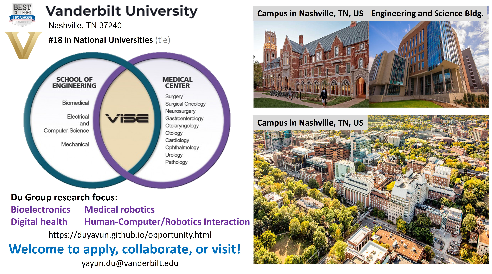

# Open Opportunity
 

## Opening postdoc positions
* We are actively looking for one postdoc or computer engineering/science technician to work on **multimodal wireless bioelectronics**. 

Strong candidates should send 1) Cover Letter, 2) resume/CV, and 3) representative papers in a single PDF to Dr. Yayun Du via email yayun.du@vanderbilt.edu. 

## Opening PhD positions
* We welcome exceptional Ph.D. candidates with a passion for pioneering advancements in bioelectronics, medical robotics, and human-robot/computer interaction. If you're eager to make a transformative impact in these fields, we encourage you to apply. One Ph.D. position on bioelectronics and embedded AI; One Ph.D. position on robotics and control for challenging environment including medical applications and human-robot interaction

Please send your Cover Letter, resume/CV and representative papers (if any) in a single PDF to Dr. Yayun Du via email yayun.du@vanderbilt.edu. Please also fill this [**Survey Form, Graduate**](https://docs.google.com/forms/d/e/1FAIpQLSe2R8mHHPZ7_6N7D8787DcqJr44bk4RXI-nqb5jpJEmQChdRg/viewform?vc=0&c=0&w=1&flr=0). 

## Master and undergraduate students
* Dr. Du's mentees have a strong track record of success, with many gaining admission to top graduate programs, including MIT, Stanford, Cornell, CMU, UCLA, University of Michigan, UIUC, and Dartmouth, or securing influential positions in industry with companies like JPL, Google, Amazon Robotics, TuSimple, and General Motors. We invite motivated Master's and undergraduate students to join our research projects in bioelectronics and digital health, with applications in both hospital and home settings. Our work also delves into medical robotics for critical environments like intensive care units (ICUs) and multimodal physiology-driven human-robot/computer interaction for safe and efficient collaboration. If you're passionate about advancing these fields, we encourage you to apply.

Interested students should fill out this [**Survey Form, UG**](https://docs.google.com/forms/d/e/1FAIpQLSe2R8mHHPZ7_6N7D8787DcqJr44bk4RXI-nqb5jpJEmQChdRg/viewform?vc=0&c=0&w=1&flr=0), and send 1) Cover Letter, 2) resume/CV, 3) unofficial transcript in a single PDF to Dr. Yayun Du via email yayun.du@vanderbilt.edu. 

## Visiting students and researchers
* We welcome inquiries from visiting students and researchers interested in short-term and long-term visits and collaborative opportunities. 

Please send your Cover Letter, resume/CV and representative papers (if any) in a single PDF to Dr. Yayun Du via email yayun.du@vanderbilt.edu. I will try to reach you back as soon as possible.

[back](./)
