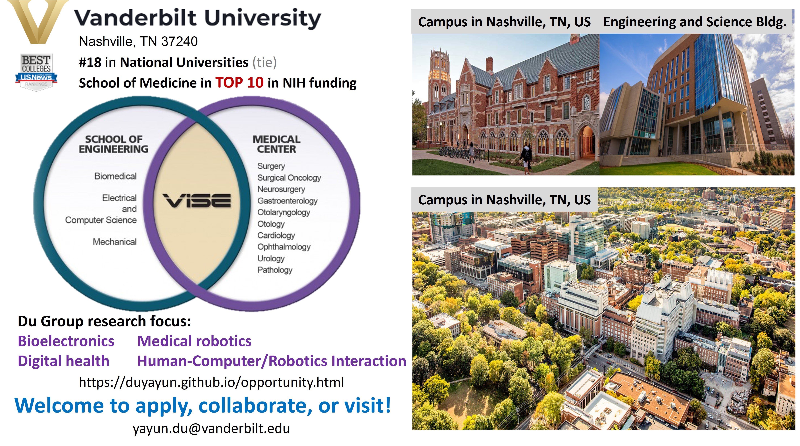

# Open Opportunity
 

## Open postdoc positions
* We are actively looking for one postdoc in bioresorbable materials or general material science to work on **multimodal wireless bioelectronics**. 

Strong candidates should send 1) Cover Letter, 2) resume/CV, and 3) representative papers in a single PDF to Dr. Yayun Du via email yayun.du[at]vanderbilt.edu. 

## Open PhD positions
We welcome exceptional Ph.D. candidates with a passion for pioneering advancements in bioelectronics, medical robotics, and human-robot/computer interaction. If you're eager to make a transformative impact in these fields, we encourage you to apply.

We are currently seeking:

* 1-2 Ph.D. students in bioelectronics: We are particularly interested in candidates with skills in circuit design, embedded system programming, signal processing, or embedded AI, but we welcome anyone with a strong interest and background in bioelectronics.
* 1 Ph.D. student in robotics and control: Ideal candidates will have experience in robotic design, control systems, learning techniques (esp. reinforcement learning), sensor fusion, SLAM, with a preference for those familiar with ROS and medical or human-robot interaction applications.
We encourage applications from students who are excited about working in interdisciplinary fields and are motivated to develop innovative solutions for challenging environments, including medical applications.

Please **submit your application to the Electrical and Computer Engineering PhD program** at Vanderbilt by **November 1th, 2024** for Spring 2026 admissions and **December 15th, 2026** for Fall 2026 admissions. For detailed instructions, visit the [ECE Graduate Admissions page](https://engineering.vanderbilt.edu/departments/electrical-computer-engineering/graduate-programs/). After submitting your program application, please fill out this [**Application Form, Graduate**](https://docs.google.com/forms/d/e/1FAIpQLSe2R8mHHPZ7_6N7D8787DcqJr44bk4RXI-nqb5jpJEmQChdRg/viewform?vc=0&c=0&w=1&flr=0) and a single PDF containing your Cover Letter, resume/CV, and representative papers (if any) to Dr. Yayun Du via email yayun.du[at]vanderbilt.edu. 

## Master and undergraduate students
* Dr. Du's mentees have a strong track record of success, with many gaining admission to top graduate programs, including MIT, Stanford, Cornell, CMU, UCLA, University of Michigan, UIUC, and Dartmouth, or securing influential positions in industry with companies like JPL, Google, Amazon Robotics, TuSimple, and General Motors. We invite motivated Master's and undergraduate students to join our research projects in bioelectronics and digital health, with applications in both hospital and home settings. Our work also delves into medical robotics for critical environments like intensive care units (ICUs) and multimodal physiology-driven human-robot/computer interaction for safe and efficient collaboration. If you're passionate about advancing these fields, we encourage you to apply.

Interested students should fill out this [**Application Form, UG**](https://docs.google.com/forms/d/e/1FAIpQLScnE5Xv6dM9p-uiq6Hs6dHbGOrvCP1M-TB0nSdVcg6Z8wF-kA/viewform?usp=dialog), and send 1) Cover Letter, 2) resume/CV, 3) unofficial transcript in a single PDF to Dr. Yayun Du via email yayun.du[at]vanderbilt.edu. 

## Visiting students and researchers
* We welcome inquiries from visiting students and researchers interested in short-term and long-term visits and collaborative opportunities. 

Please send your Cover Letter, resume/CV and representative papers (if any) in a single PDF to Dr. Yayun Du via email yayun.du[at]vanderbilt.edu. I will try to reach you back as soon as possible.

## Why Vanderbilt? Why Us?
Joining Vanderbilt University, consistently ranked among the Top 20 national universities in the U.S., means becoming part of a leading research institution with a strong emphasis on innovation and collaboration. As a key player in bioelectronics and medical technologies, our lab works closely with the Vanderbilt Institute for Surgery and Engineering (VISE), where engineers and clinicians unite to develop groundbreaking solutions for real-world medical challenges. With Vanderbilt University School of Medicine consistently ranking in the Top 10 for NIH funding, students have access to a wealth of resources and opportunities to make a tangible impact in healthcare. Located in Nashville, a growing hub for biotechnology and healthcare innovation, you'll be at the heart of a vibrant community that blends academic excellence with industry connections, offering a unique environment to advance your career in bioelectronics and medical robotics.

[back](./)
