# Selected Publications

Research works are being submitted and submitted to prestigious journals (some of them impact factor > xx) that are forthcoming. Research works are published in RAL, ICRA, IROS, RoboSoft, etc.

# **Wireless multimodal wearable sensors with XAI (high-impact first-authored papers forthcoming)**
* **Key words**: Digital health, multimodality, disease diagnosis, cardiovascular health, neurology, drug delivery, behavior science
 
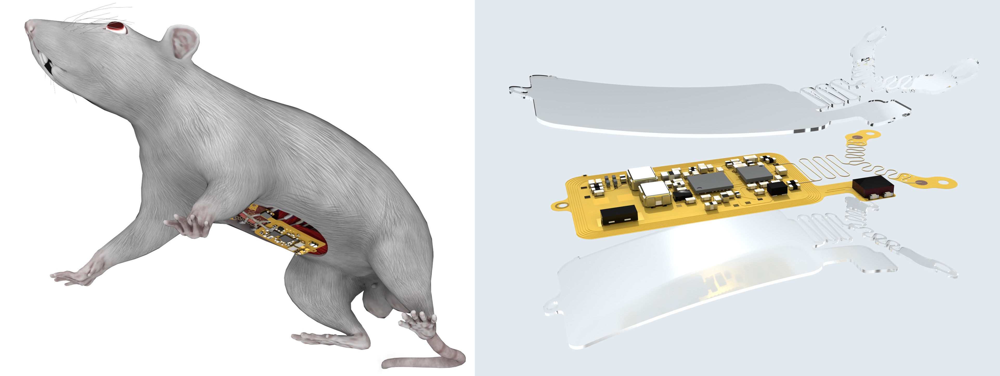 
* - **Y. Du**#, J. Gu#, S. Duan#, J. Trueb, A. Tzavelis, H.-S. Shin, H. Arafa, X. Li, Y. Huang, A. N. Carr, C. R. Davies, J. A. Rogers,  
  [_A skin-interfaced wireless wearable device and data analytics approach for sleep-stage and disorder detection_](https://www.pnas.org/doi/10.1073/pnas.2501220122),  
  *Proceedings of the National Academy of Sciences (PNAS)*, 2025, [Media coverage 1](https://news.feinberg.northwestern.edu/2025/06/20/wearable-sleep-monitoring-device-may-improve-detection-of-sleep-disorders/), [Media coverage 2](https://engineering.vanderbilt.edu/2025/06/24/ai-enhanced-wearable-sleep-monitoring-device-aims-to-improve-detection-of-sleep-disorders/) 

**Key words**: Wearable electronics, digital health, sleep study, sleep apneas, data analytics  
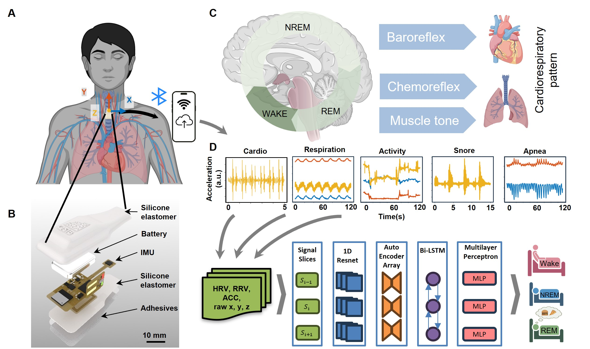

* L. C. Alarcón-Segovia, K. E. Madsen, C. Liu, S. H. Kim, T. W. Park, **Y. Du**, K. Salame, J. Rogers,  
  [_Ultralow-cost hydrogel electrolytes based on agricultural by-products for distributed electrophysiological recording in resource-limited settings_](https://pubs.acs.org/doi/10.1021/acssuschemeng.4c07823), *ACS Sustainable Chemistry & Engineering*, April 2025

# **Pain study with multimodal wearables in the NICU**
* Slattery, S., Pessano, S., Yoo, **Du, Y.**, J., Oh, S., Jeong, H., Alla, A., Rand, C., Hamvas, A., Mayer, D., Rogers, J., Continuous monitoring with wireless sensors and applied diagnostics for pain with Clinical Sensor Pain Scale and computer-aided Automated Sensor Pain Scale in the NICU, BMJ Health & Care Informatics (Under review)

# **Autonomous agricultural robots**

<iframe width="846" height="502" src="https://www.youtube.com/embed/9e3Q_9aTCQ4" title="YouTube video player" frameborder="0" allow="accelerometer; autoplay; clipboard-write; encrypted-media; gyroscope; picture-in-picture" allowfullscreen></iframe>

* **Du, Y.**, Saha, S.*, Sandha, S., Lovekin, A.#, Wu, J., Siddharth, S.,Chowdhary, M., Jawed, M. K.,Srivastava, M., Neural-Kalman GNSS/INS Navigation for Precision Agriculture, ICRA, 2023 [Link](https://ieeexplore.ieee.org/document/10161351)

<!-- 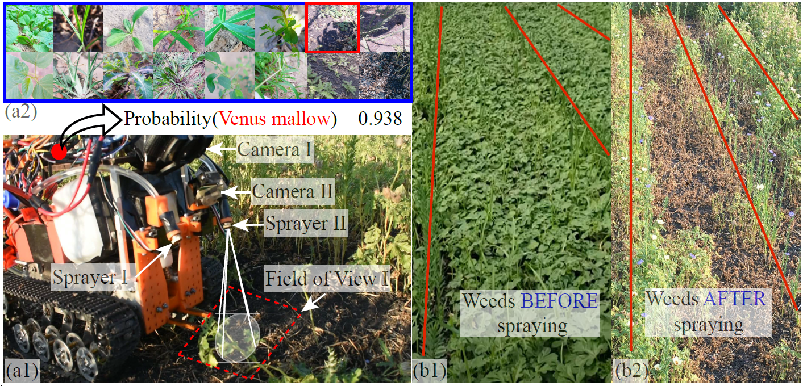 -->

<iframe width="846" height="502" src="https://www.youtube.com/embed/A_5zkgusCTU" title="YouTube video player" frameborder="0" allow="accelerometer; autoplay; clipboard-write; encrypted-media; gyroscope; picture-in-picture" allowfullscreen></iframe>

> Precision agricultural robots require high-resolution navigation solutions. In this paper, we introduce a robust neural-inertial sequence learning approach to track such robots with ultra-intermittent GNSS updates. First, we propose an ultra-lightweight neural-Kalman filter that can track agricultural robots within 1.4 m (1.4–5.8× better than competing techniques), while tracking within 2.75 m with 20 mins of GPS outage. Second, we introduce a user-friendly video-processing toolbox to generate high-resolution (±5 cm) position data for fine-tuning pre-trained neural-inertial models in the field. Third, we introduce the first and largest (6.5 hours, 4.5 km, 3 phases) public neural-inertial navigation dataset for precision agricultural robots. The dataset, toolbox, and code are available at: https://github.com/nesl/agrobot.

<!--   -->
<iframe width="846" height="502" src="https://www.youtube.com/embed/mLXtLS94m38" title="YouTube video player" frameborder="0" allow="accelerometer; autoplay; clipboard-write; encrypted-media; gyroscope; picture-in-picture" allowfullscreen></iframe>

* **Du, Y.**, Zhang, G.#, Tsang D.#, Jawed, M. K., Deep-CNN based real-time robotic multi-class weed identification, IEEE International Conference on Robotics and Automation (ICRA), 2022 [Link](https://ieeexplore.ieee.org/document/9812240)

 

<!--  
   -->

> Smart weeding systems to perform plant-specific operations can contribute to the sustainability of agriculture and the environment. Despite monumental advances in autonomous robotic technologies for precision weed management in recent years, work on under-canopy weeding in fields is yet to be realized. A prerequisite of such systems is reliable detection and classification of weeds to avoid mistakenly spraying and, thus, damaging the surrounding plants. Real-time multi-class weed identification enables species-specific treatment of weeds and significantly reduces the amount of herbicide use. Here, our first contribution is the first adequately large realistic image dataset AIWeeds (one/multiple kinds of weeds in one image), a library of about 10,000 annotated images of flax and the 14 most common weeds in fields and gardens taken from 20 different locations in North Dakota, California, and Central China. Second, we provide a full pipeline from model training with maximum efficiency to deploying the TensorRT-optimized model onto a single board computer. Based on AIWeeds and the pipeline, we present a baseline for classification performance using five benchmark CNN models. Among them, MobileNetV2, with both the shortest inference time and lowest memory consumption, is the qualified candidate for real-time applications. Finally, we deploy MobileNetV2 onto our own compact autonomous robot SAMBot for real-time weed detection. The 90% test accuracy realized in previously unseen scenes in flax fields (with a row spacing of 0.2-0.3 m), with crops and weeds, distortion, blur, and shadows, is a milestone towards precision weed control in the real world. We have publicly released the dataset and code to generate the results at https://github.com/StructuresComp/Multi-class-Weed-Classification.

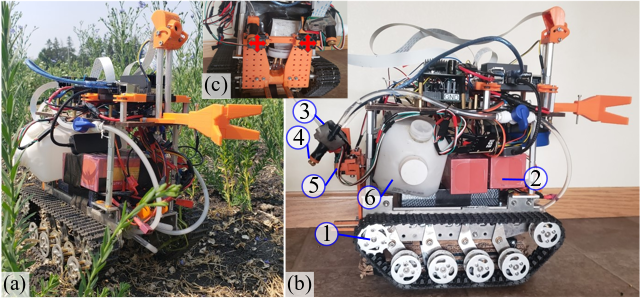 

* **Du, Y.**, Mallajosyula, B.#, Sun, D.#, Chen, J.#, Zhao, Z.#, Rahman, M., Quadir, M., Jawed, M. K., A Low-cost Robot with Autonomous Recharge and Navigation for Weed Control  in  Fields  with  Narrow  Row  Spacing, International Conference on Intelligent Robots and Systems (IROS), Prague, Czech Republic, 2021 (Finalists for **Best Paper Award on Agri-Robotics**, **Best Paper Award on Robot Mechanisms and Design**) 

> Modern herbicide application in agricultural settings typically relies on either large scale sprayers that dispense herbicide over crops and weeds alike or portable sprayers that require labor intensive manual operation. The former method results in overuse of herbicide and reduction in crop yield while the latter is often untenable in large scale operations. This paper presents the first fully autonomous robot for weed management
for row crops capable of computer vision based navigation, weed detection, complete field coverage, and automatic recharge for under $400. The target application is autonomous interrow weed control in crop fields, e.g. flax and canola, where the spacing between croplines is as small as one foot. The proposed robot is small enough to pass between croplines at all stages of plant growth while detecting weeds and spraying
herbicide. A recharging system incorporates newly designed robotic hardware, a ramp, a robotic charging arm, and a mobile charging station. An integrated vision algorithm is employed to assist with charger alignment effectively. Combined, they enable the robot to work continuously in the field without access to electricity. In addition, a color-based contour algorithm combined with preprocessing techniques is applied for robust
navigation relying on the input from the onboard monocular camera. Incorporating such compact robots into farms could help automate weed control, even during late stages of growth, and reduce herbicide use by targeting weeds with precision. The robotic platform is field-tested in the flaxseed fields of North Dakota.

<iframe width="846" height="502" src="https://www.youtube.com/embed/-m_t2uBjU_I" title="YouTube video player" frameborder="0" allow="accelerometer; autoplay; clipboard-write; encrypted-media; gyroscope; picture-in-picture" allowfullscreen></iframe>

# **Edge AI-related healthcare & inertial navigation**
* Forthcoming several wearable and implantable sensors with deployable AI algorithms with limited computational power and memory
* Saha, S., **Du, Y.**, Sandha, S., Garcia, L., Jawed, M. K.,Srivastava, M., Inertial Navigation on Extremely Resource-Constrained Platforms: Methods, Opportunities and Challenges, IEEE/ION PLANS, 2023 [link](https://ieeexplore.ieee.org/document/10139997)

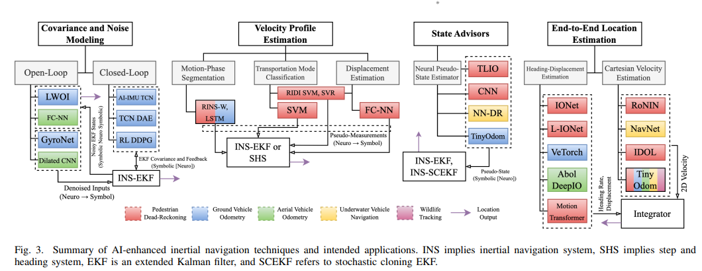 
<!--   -->

# **Robotic arm control for autonomous robotic painting**

<iframe width="846" height="502" src="https://www.youtube.com/embed/upDizLiNd2s" title="YouTube video player" frameborder="0" allow="accelerometer; autoplay; clipboard-write; encrypted-media; gyroscope; picture-in-picture" allowfullscreen></iframe>

* **Du, Y.**, Deng, Z. #, Fang, Z.#, Wang, Y.#, Nagata, T.#, Bansal, K., Quadir, M., Jawed, M. K., Vision and force based autonomous coating with rollers, IROS, Las Vegas, NV, USA, pp. 9954-9960, 202 [Link](https://ieeexplore.ieee.org/document/9341619/)

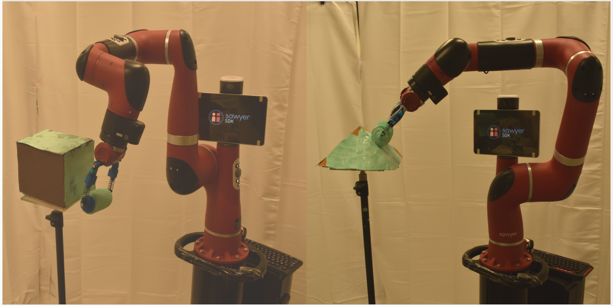

<iframe width="846" height="502" src="https://www.youtube.com/embed/jGAFGDS2plg" title="YouTube video player" frameborder="0" allow="accelerometer; autoplay; clipboard-write; encrypted-media; gyroscope; picture-in-picture" allowfullscreen></iframe>

* **Du, Y.**, Bansal, K., Palan, E., Quadir, M., Jawed, M. K., Robotic Painting: Mimicking Human Applicators, Journal of Coatings Technology and Research 2022 [link](https://link.springer.com/article/10.1007/s11998-022-00750-7)

# **Bacteria-inspired flagellated robots**
<iframe width="846" height="502" src="https://www.youtube.com/embed/zTPne5uclnw" title="YouTube video player" frameborder="0" allow="accelerometer; autoplay; clipboard-write; encrypted-media; gyroscope; picture-in-picture" allowfullscreen></iframe>

* **Du, Y.**, Lam, J.,#, Sachanandani, K.#, Jawed, M. K., Modeling the locomotion of articulated soft robots in
granular medium, IEEE Robotics and Automation Letter (RAL) 2022 & ICRA 2023 [link](https://ieeexplore.ieee.org/document/9770399)

<iframe width="846" height="502" src="https://www.youtube.com/embed/X5xtlZD6EvE" title="YouTube video player" frameborder="0" allow="accelerometer; autoplay; clipboard-write; encrypted-media; gyroscope; picture-in-picture" allowfullscreen></iframe>

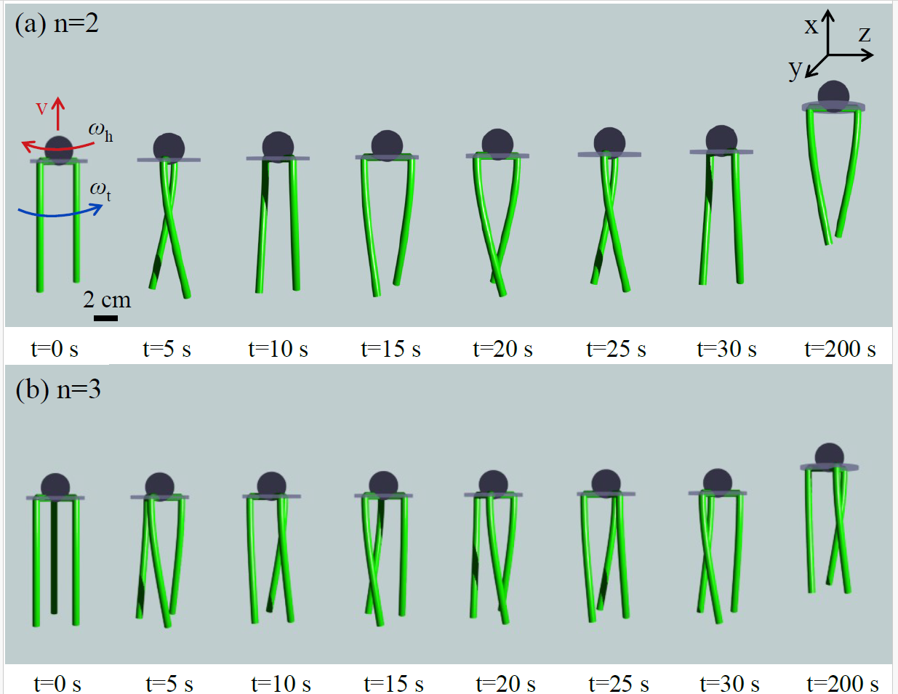
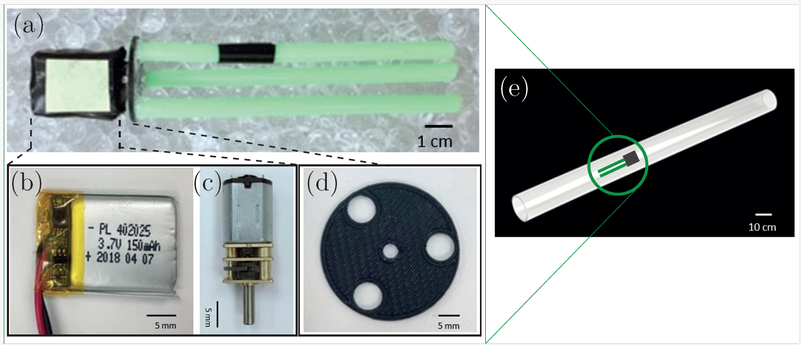

* **Du, Y.**, Miller, A.#, Jawed, M. K., Simple Flagellated Soft Robot for Locomotion near Air-Liquid Interface, IEEE International Conference on Soft Robotics (RoboSoft), Yale, CT, 2021 [link](https://ieeexplore.ieee.org/stamp/stamp.jsp?tp=&arnumber=9479198&tag=1)

<iframe width="846" height="502" src="https://www.youtube.com/embed/c-XRC57cA90" title="YouTube video player" frameborder="0" allow="accelerometer; autoplay; clipboard-write; encrypted-media; gyroscope; picture-in-picture" allowfullscreen></iframe>

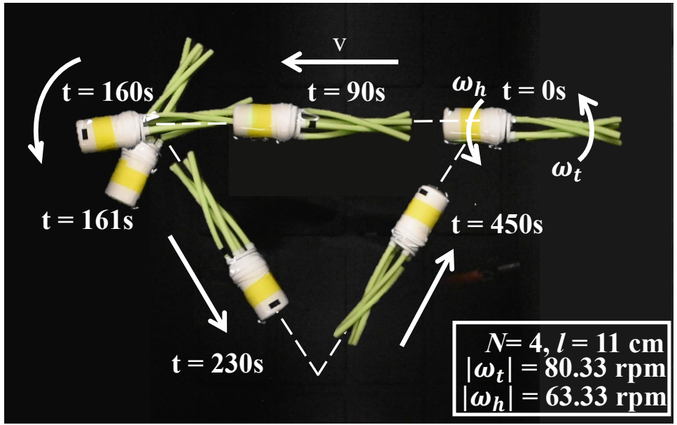

# **To be continued (Bacteria-inspired soft robots for autonomous navigation etc)**

<!-- 
## Magnetically actuated endoscopes for GI tract medical operation

Journal paper: Son, D., **Dong, X.** and Sitti, M., 2018. A simultaneous calibration method for magnetic robot localization and actuation systems. IEEE Transactions on Robotics, 35(2), pp.343-352. [link](https://ieeexplore.ieee.org/abstract/document/8594561)

[European patent](https://data.epo.org/publication-server/document?iDocId=6267866&iFormat=2)

[US patent](https://patentimages.storage.googleapis.com/22/4d/c0/fbea0611f36694/US20200196844A1.pdf)

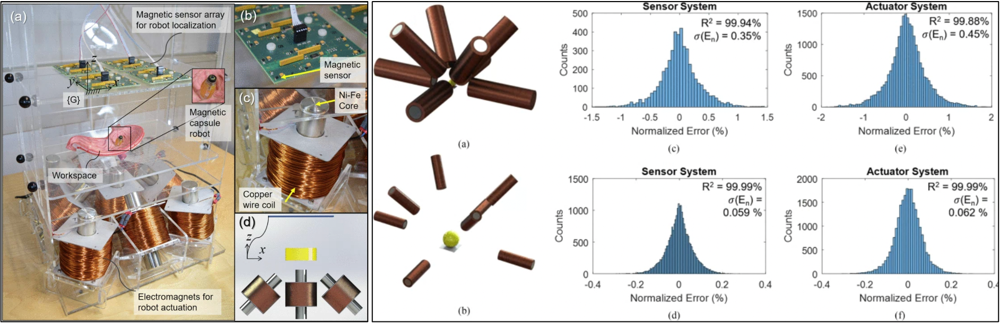 

> This paper proposes a method of simultaneously calibrating magnetic localization and actuation systems for magnetically actuated robots. In this method, uncalibrated magnetic localization and actuation systems are calibrated simultaneously with minimal human intervention, which enables self-calibration, flexible reconfiguration, and long-term correctness of the system parameters. This method employs a bundle adjustment framework using a quadratic measurement model for sensors and the magnetic dipole model for actuators. The proposed method has been verified in comparison with finite element simulations and existing calibration methods for magnetic actuators and sensor arrays. In the experiments, the determinant of coefficient (R2 value) was 99.84% for the sensor system and 99.45% for the actuator system after the calibration, comparable with individual state-of-art calibration methods of calibrating magnetic actuators and sensor arrays. This method has potential to improve the reconfigurability and long-term accuracy of magnetic robot localization and actuation systems, such as magnetically actuated capsule endoscopes.

## Artificial cilia for biofluid pumping and studying biomechanics
Journal paper: **Dong, X.#**, Lum, G.Z.#, Hu, W.#, Zhang, R., Ren, Z., Onck, P.R. and Sitti, M., 2020. Bioinspired cilia arrays with programmable nonreciprocal motion and metachronal coordination. Science advances, 6(45), p.eabc9323. [Link](https://advances.sciencemag.org/content/6/45/eabc9323)

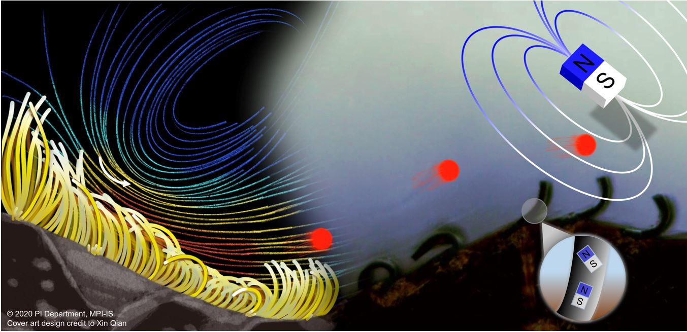 

> Coordinated nonreciprocal dynamics in biological cilia is essential to many living systems, where the emergentmetachronal waves of cilia have been hypothesized to enhance net fluid flows at low Reynolds numbers (Re). Experimental investigation of this hypothesis is critical but remains challenging. Here, we report soft miniature devices with both ciliary nonreciprocal motion and metachronal coordination and use them to investigate the quantitative relationship between metachronal coordination and the induced fluid flow. We found that only antiplectic metachronal waves with specific wave vectors could enhance fluid flows compared with the synchronized case. These findings further enable various bioinspired cilia arrays with unique functionalities of pumping and mixing viscous synthetic and biological complex fluids at low Re. Our design method and developed soft miniature devices provide unprecedented opportunities for studying ciliary biomechanics and creating cilia-inspired wireless microfluidic pumping, object manipulation and lab- and organ-on-a-chip devices, mobile microrobots, and bioengineering systems.

---------
*********

# **Bioinspired soft robots**
* **Key words**: soft robots, bioinspiration, biomechanics, swimming robots, fluidic manipulation

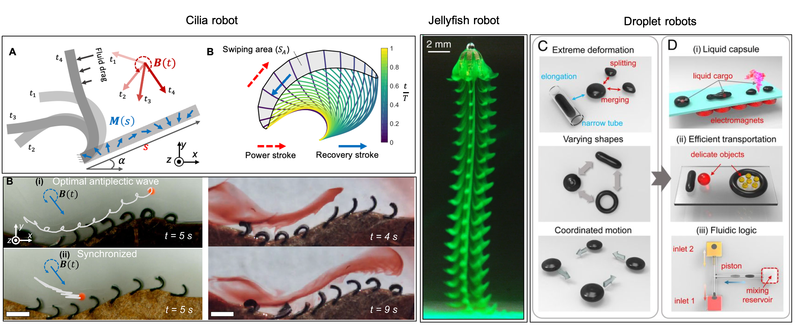 

## Design methodology of magnetic soft robots
Journal paper: Lum, G.Z.#, Ye, Z.#, **Dong, X.#**, Marvi, H., Erin, O., Hu, W. and Sitti, M., 2016. Shape-programmable magnetic soft matter. Proceedings of the National Academy of Sciences, 113(41), pp.E6007-E6015. [Link](https://www.pnas.org/content/113/41/E6007) 

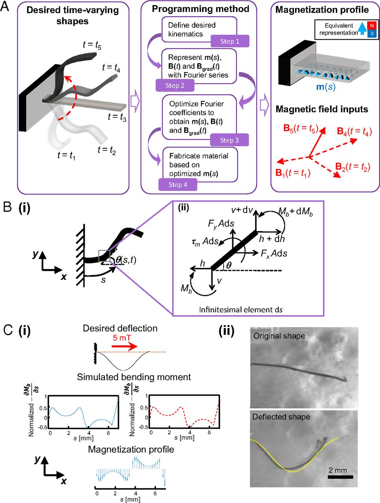

> At small scales, shape-programmable magnetic materials have significant potential to achieve mechanical functionalities that are unattainable by traditional miniature machines. Unfortunately, these materials have only been programmed for a small number of specific applications, as previous work can only rely on human intuition to approximate the required magnetization profile and actuating magnetic fields for such materials. Here, we propose a universal programming methodology that can automatically generate the desired magnetization profile and actuating fields for soft materials to achieve new time-varying shapes. The proposed method can enable other researchers to fully capitalize the potential of shape-programming technologies, allowing them to create a wide range of novel soft active surfaces and devices that are critical in robotics, material science, and medicine.

## Bio-inspired swimming robots 
Journal paper: Ren, Z.#, Hu, W.#, **Dong, X.** and Sitti, M., 2019. Multi-functional soft-bodied jellyfish-like swimming. Nature communications, 10(1), pp.1-12. [Link](https://www.nature.com/articles/s41467-019-10549-7.pdf)

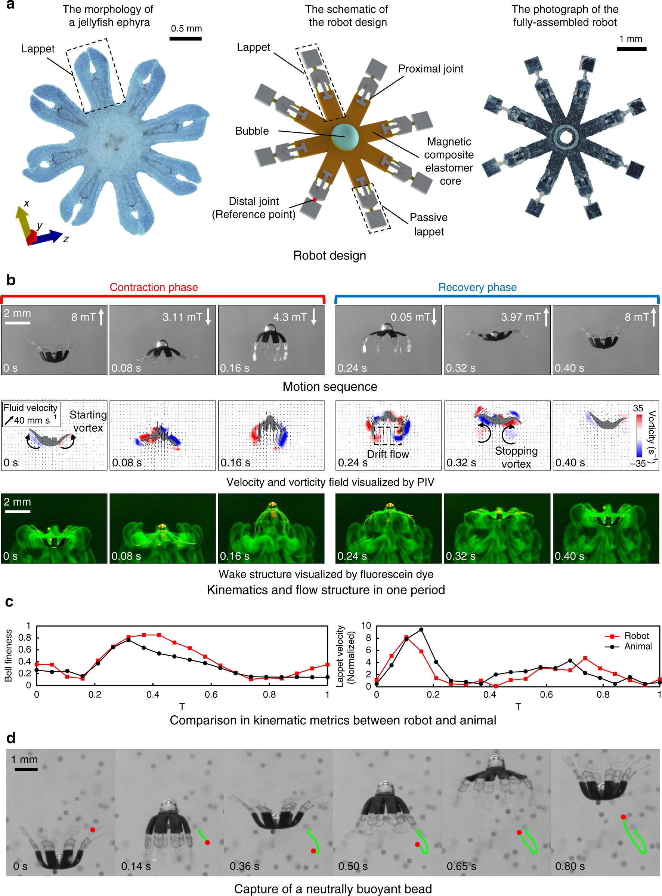 

> The functionalities of the untethered miniature swimming robots significantly decrease as the robot size becomes smaller, due to limitations of feasible miniaturized on-board components. Here we propose an untethered jellyfish-inspired soft millirobot that could realize multiple functionalities in moderate Reynolds number by producing diverse controlled fluidic flows around its body using its magnetic composite elastomer lappets, which are actuated by an external oscillating magnetic field. We particularly investigate the interaction between the robot’s soft body and incurred fluidic flows due to the robot’s body motion, and utilize such physical interaction to achieve different predation-inspired object manipulation tasks. The proposed lappet kinematics can inspire other existing jellyfish-like robots to achieve similar functionalities at the same length and time scale. Moreover, the robotic platform could be used to study the impacts of the morphology and kinematics changing in ephyra jellyfish.

## Droplet soft robots with extreme deformation

Journal paper: an, X.#, **Dong, X.#**, Karacakol, A.C., Xie, H. and Sitti, M., 2020. Reconfigurable multifunctional ferrofluid droplet robots. Proceedings of the National Academy of Sciences, 117(45), pp.27916-27926. [Link](https://www.pnas.org/content/117/45/27916.short)

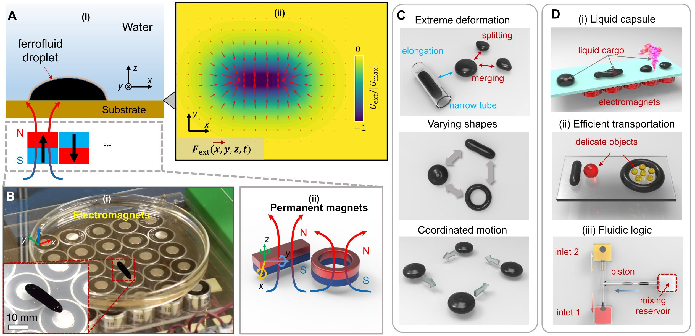 
> Magnetically actuated miniature soft robots are capable of programmable deformations for multimodal locomotion and manipulation functions, potentially enabling direct access to currently unreachable or difficult-to-access regions inside the human body for minimally invasive medical operations. However, magnetic miniature soft robots are so far mostly based on elastomers, where their limited deformability prevents them from navigating inside clustered and very constrained environments, such as squeezing through narrow crevices much smaller than the robot size. Moreover, their functionalities are currently restricted by their predesigned shapes, which is challenging to be reconfigured in situ in enclosed spaces. 

> Here, we report a method to actuate and control ferrofluid droplets as shape-programmable magnetic miniature soft robots, which can navigate in two dimensions through narrow channels much smaller than their sizes thanks to their liquid properties. By controlling the external magnetic fields spatiotemporally, these droplet robots can also be reconfigured to exhibit multiple functionalities, including on-demand splitting and merging for delivering liquid cargos and morphing into different shapes for efficient and versatile manipulation of delicate objects. In addition, a single-droplet robot can be controlled to split into multiple subdroplets and complete cooperative tasks, such as working as a programmable fluidic-mixing device for addressable and sequential mixing of different liquids. Due to their extreme deformability, in situ reconfigurability and cooperative behavior, the proposed ferrofluid droplet robots could open up a wide range of unprecedented functionalities for lab/organ-on-a-chip, fluidics, bioengineering, and medical device applications.

<iframe width="820" height="462" src="https://www.youtube.com/embed/vYDYIHm5EN0" title="YouTube video player" frameborder="0" allow="accelerometer; autoplay; clipboard-write; encrypted-media; gyroscope; picture-in-picture" allowfullscreen></iframe>

---------
*********

# **Swarm microrobots**
* **Key words**: control, collective motion, cooperative behaviors

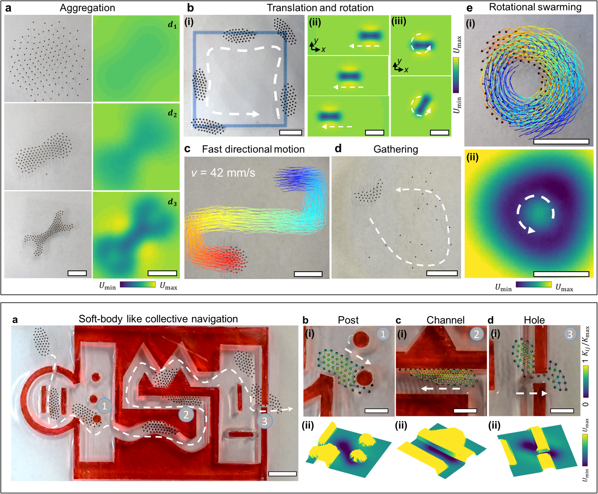 

## Reconfigurable and cooperative swarms
Journal paper: Dong, X. and Sitti, M., 2020. Controlling two-dimensional collective formation and cooperative behavior of magnetic microrobot swarms. The International Journal of Robotics Research, 39(5), pp.617-638. [Link](https://journals.sagepub.com/doi/full/10.1177/0278364920903107)

<iframe width="410" height="307" src="https://www.youtube.com/embed/TVcUt4bgYEE" title="YouTube video player" frameborder="0" allow="accelerometer; autoplay; clipboard-write; encrypted-media; gyroscope; picture-in-picture" allowfullscreen></iframe>

<iframe width="410" height="307" src="https://www.youtube.com/embed/1NgyePOxXTI" title="YouTube video player" frameborder="0" allow="accelerometer; autoplay; clipboard-write; encrypted-media; gyroscope; picture-in-picture" allowfullscreen></iframe>

## Programmable static formations
Conference paper: Dong, X. and Sitti, M., 2019. Collective Formation and Cooperative Function of a Magnetic Microrobotic Swarm. In Robotics: Science and Systems. [Link](http://m.roboticsproceedings.org/rss15/p07.pdf)

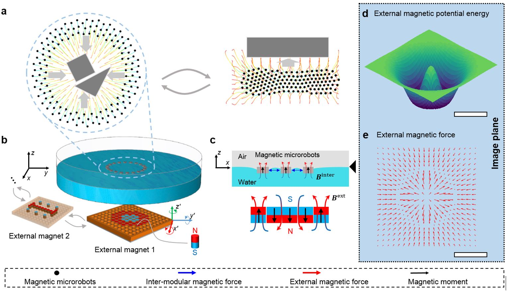 
> Magnetically actuated mobile microrobots can access distant, enclosed, and small spaces, such as inside microfluidic channels and the human body, making them appealing for minimally invasive tasks. Despite their simplicity when scaling down, creating collective microrobots that can work closely and cooperatively, as well as reconfigure their formations for different tasks, would significantly enhance their capabilities such as manipulation of objects. However, a challenge of realizing such cooperative magnetic microrobots is to program and reconfigure their formations and collective motions with under-actuated control signals. This article presents a method of controlling 2D static and time-varying formations among collective self-repelling ferromagnetic microrobots (100 μm to 350 μm in diameter, up to 260 in number) by spatially and temporally programming an external magnetic potential energy distribution at the air–water interface or on solid surfaces. A general design method is introduced to program external magnetic potential energy using ferromagnets. A predictive model of the collective system is also presented to predict the formation and guide the design procedure. With the proposed method, versatile complex static formations are experimentally demonstrated and the programmability and scaling effects of formations are analyzed. We also demonstrate the collective mobility of these magnetic microrobots by controlling them to exhibit bio-inspired collective behaviors such as aggregation, directional motion with arbitrary swarm headings, and rotational swarming motion. Finally, the functions of the produced microrobotic swarm are demonstrated by controlling them to navigate through cluttered environments and complete reconfigurable cooperative manipulation tasks.

# **Microrobots for manipulation**

**Key words**: soft microgrippers, control and motion planning, 3D assseembly, tissue engineering
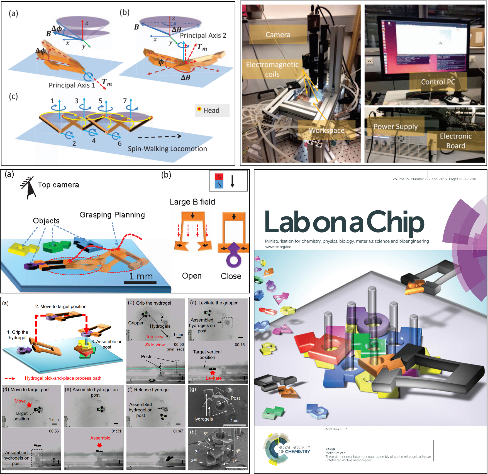 

## 3D dexterous manipulation
Journal paper: Chung, S.E.#, **Dong, X.#** and Sitti, M., 2015. Three-dimensional heterogeneous assembly of coded microgels using an untethered mobile microgripper. Lab on a Chip, 15(7), pp.1667-1676. [Link](https://pubs.rsc.org/en/content/articlepdf/2015/lc/c5lc00009b)

> Abstract: Three-dimensional (3D) heterogeneous assembly of coded microgels in enclosed aquatic environments is demonstrated using a remotely actuated and controlled magnetic microgripper by a customized electromagnetic coil system. The microgripper uses different ‘stick–slip’ and ‘rolling’ locomotion in 2D and also levitation in 3D by magnetic gradient-based pulling force. This enables the microrobot to precisely manipulate each microgel by controlling its position and orientation in all x–y–z directions. Our microrobotic assembly method broke the barrier of limitation on the number of assembled microgel layers, because it enabled precise 3D levitation of the microgripper. We used the gripper to assemble microgels that had been coded with different colours and shapes onto prefabricated polymeric microposts. This eliminates the need for extra secondary cross-linking to fix the final construct. We demonstrated assembly of microgels on a single micropost up to ten layers. By increasing the number and changing the distribution of the posts, complex heterogeneous microsystems were possible to construct in 3D.

<iframe width="820" height="496" src="https://www.youtube.com/embed/gAwHHdvs4Eo" title="YouTube video player" frameborder="0" allow="accelerometer; autoplay; clipboard-write; encrypted-media; gyroscope; picture-in-picture" allowfullscreen></iframe>

## Motion planning for automatic grasping
Conference paper: **Dong, X.** and Sitti, M., 2017, May. Planning spin-walking locomotion for automatic grasping of microobjects by an untethered magnetic microgripper. In 2017 IEEE International Conference on Robotics and Automation (ICRA) (pp. 6612-6618). IEEE. [Link](https://ieeexplore.ieee.org/abstract/document/7989782)

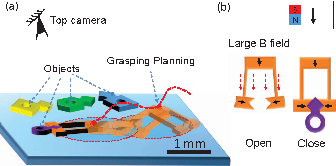 

> Most demonstrated mobile microrobot tasks so far have been achieved via pick-and-placing and dynamic trapping with teleoperation or simple path following algorithms. In our previous work, an untethered magnetic microgripper has been developed which has advanced functions, such as gripping objects. Both teleoperated manipulation in 2D and 3D have been demonstrated. However, it is challenging to control the magnetic microgripper to carry out manipulation tasks, because the grasping of objects so far in the literature relies heavily on teleoperation, which takes several minutes with even a skilled human expert. Here, we propose a new spin-walking locomotion and an automated 2D grasping motion planner for the microgripper, which enables time-efficient automatic grasping of microobjects that has not been achieved yet for untethered microrobots. In its locomotion, the microgripper repeatedly rotates about two principal axes to regulate its pose and move precisely on a surface. The motion planner could plan different motion primitives for grasping and compensate the uncertainties in the motion by learning the uncertainties and planning accordingly. We experimentally demonstrated that, using the proposed method, the microgripper could align to the target pose with error less than 0.1 body length and grip the objects within 40 seconds. Our method could significantly improve the time efficiency of micro-scale manipulation and have potential applications in microassembly and biomedical engineering. -->

(# indicates students supervised or mentored by Yayun Du)

[back](./)

